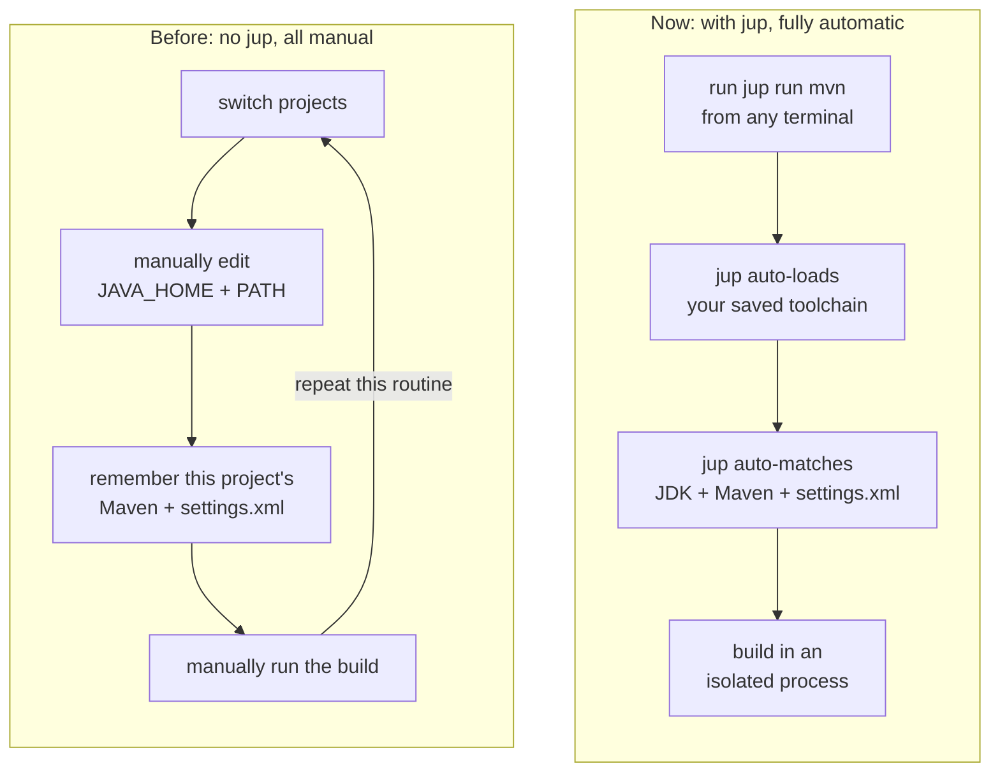

<h1 align="center">javaup</h1>

<p align="center">English | <a href="README.zh-CN.md">简体中文</a></p>

<p align="center"><strong>Let every Maven project use the right Java toolchain automatically.</strong></p>

<p align="center">
  <a href="https://github.com/codeboyzhou/javaup/releases/latest"></a>
  
  <a href="https://github.com/codeboyzhou/javaup/actions/workflows/ci.yml"></a>
  
  <a href="LICENSE"></a>
</p>

`javaup` is a Java toolchain manager for Maven projects. It automatically
detects the Java version and `mvn` executable each project needs, and remembers
its selected `settings.xml`. Initialize a project once, then build it from any
terminal with a single command — without worrying about using the wrong JDK,
Maven executable, or `settings.xml` file.

<p align="center">
  
</p>

## Why javaup?

A single dev machine often runs Maven builds that target several different Java
versions, such as Java 8, Java 17, and Java 21. Without `jup`, every project
switch means manually editing `JAVA_HOME` and `PATH`, keeping track of which
Java version and which Maven each repository needs, and occasionally dealing
with projects that rely on different `settings.xml` files. It all gets tedious.

`javaup` (command: `jup`) takes care of this for you. It automatically detects
the Java version a Maven project needs, picks a matching local JDK, and
remembers the Maven executable, JDK, and optional `settings.xml` path that
project uses. It then runs the build in a fresh child process, leaving your
machine's environment variables and your current shell completely untouched —
safe, convenient, and fast.



`jup` complements existing Java tools instead of replacing them:

- **SDKMAN! and asdf** install or switch tools for a user or shell. `jup` can
  discover their JDKs, as well as JDKs exposed through environment variables
  and PATH.
- **Maven Wrapper** pins the Maven distribution for a repository. `jup` detects
  and prefers it automatically.
- **Maven Toolchains** lets Maven plugins select a JDK. `jup` also discovers
  `<jdkHome>` entries and controls the JDK that launches Maven itself.

The layer `jup` adds is a durable local project binding:
**this Maven executable + this JDK + this settings alias**,
launched through one stable command from any terminal.

> [!IMPORTANT]
> `jup` selects JDKs and Maven installations that are already present. It does
> not download or uninstall them. Apache Maven is currently the only supported
> build tool.

## Install

macOS or Linux:

```shell
curl -fsSL https://github.com/codeboyzhou/javaup/releases/latest/download/install.sh | sh
```

Windows PowerShell 5.1 or later:

```powershell
irm https://github.com/codeboyzhou/javaup/releases/latest/download/install.ps1 | iex
```

Prebuilt releases support Windows, macOS, and Linux on amd64 and arm64. See the
[installation guide](https://codeboyzhou.github.io/javaup/start-here/installation/)
for checksums, `go install`, source builds, and installer options.

## Quick Start

All you need is a project with `pom.xml`, Maven Wrapper or `mvn` on PATH, and a
matching full JDK installed locally:

```shell
cd /path/to/your/maven-project
jup init
jup status
jup run mvn clean package
```

In an interactive terminal, `jup run mvn` lets you select any initialized
project, with frequently and recently used projects ranked first. In CI or
redirected pipelines, it resolves the nearest initialized project without
prompting.

## What It Does

- Detects Java requirements from POM properties, compiler plugin configuration,
  and local parent POMs.
- Prefers Maven Wrapper and falls back to Maven from PATH.
- Finds installed JDKs through Maven, SDKMAN!, asdf, environment variables,
  PATH, Maven Toolchains, and common platform locations.
- Applies the selected JDK and optional Maven settings alias only to the spawned
  build process.
- Manages and diagnoses initialized projects globally without modifying project
  source files.

## Contributing

Bug reports, compatibility cases, documentation improvements, and code
contributions are welcome. Run the complete local verification pipeline with:

```shell
go mod download
go run build.go verify
```

Read [CONTRIBUTING.md](CONTRIBUTING.md) before submitting a pull request.

## License

Licensed under the [Apache License 2.0](LICENSE).
