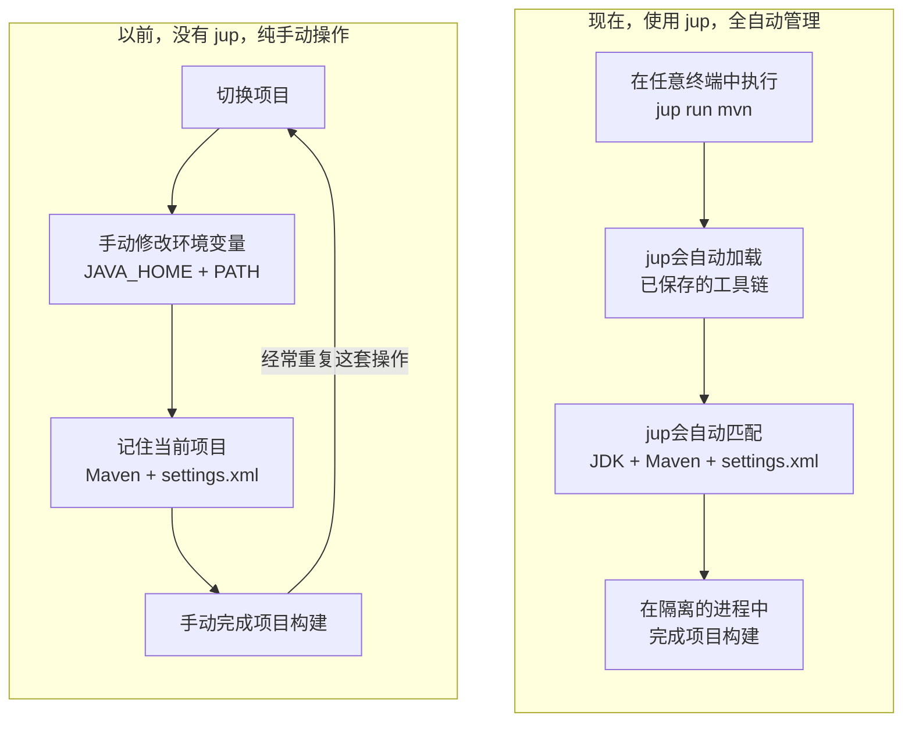

<h1 align="center">javaup</h1>

<p align="center"><a href="README.md">English</a> | 简体中文</p>

<p align="center"><strong>让每个 Maven 项目都能自动使用正确的 Java 工具链</strong></p>

<p align="center">
  <a href="https://github.com/codeboyzhou/javaup/releases/latest"></a>
  
  <a href="https://github.com/codeboyzhou/javaup/actions/workflows/ci.yml"></a>
  
  <a href="LICENSE"></a>
</p>

`javaup` 是一款面向 Maven 项目的 Java 工具链管理器，能自动识别每个项目所需的 Java 版本和 `mvn` 程序路径，并记住为项目选择的 `settings.xml` 配置文件。只需初始化一次，之后在任意终端中用一条命令便可轻松完成项目构建，无需担心 Java 版本、`mvn` 程序路径或 `settings.xml` 文件配置错误。

<p align="center">
  
</p>

## 为什么选择 javaup？

一台开发机上往往同时存在多个 Java 版本的 Maven 构建，例如 Java 8、Java 17 和 Java 21。不使用 `jup` 时，每次切换项目都要手工修改 `JAVA_HOME` 和 `PATH`，记住每个仓库应该使用哪个 Java 版本、哪个 Maven 版本，有时还会遇见不同的项目需要依赖不同的 `settings.xml` 文件配置，非常繁琐。

`javaup`（命令名 `jup`）会帮你解决这个问题。它能够自动识别 Maven 项目需要的 Java 版本，选择匹配的本地 JDK，并记住项目使用的 Maven、JDK 和可选的 `settings.xml` 文件路径。然后会在新建的子进程中完成项目构建，完全不动你本机的环境变量和当前 shell 的任何配置，安全、方便、快捷。



`jup` 是对现有 Java 工具的补充，而不是替代：

- **SDKMAN! 和 asdf** 负责安装工具或切换用户、shell 使用的版本；`jup` 可以发现它们安装的 JDK，也可以识别通过环境变量和 PATH 暴露的 JDK。
- **Maven Wrapper** 为仓库固定 Maven 发行版；`jup` 会自动发现并优先使用。
- **Maven Toolchains** 允许 Maven 插件选择 JDK；`jup` 还会读取 `<jdkHome>`，并控制启动 Maven 自身所用的 JDK。

`jup` 补充的是一份持久的本地项目绑定：**这个 Maven + 这个 JDK + 这个 settings 别名**。以后在任意终端中都可以通过同一个稳定命令启动。

> [!IMPORTANT]
> `jup` 负责选择本机已经安装的 JDK 和 Maven，不会下载或卸载它们。目前唯一支持的构建工具是 Apache Maven。

## 安装

macOS 或 Linux：

```shell
curl -fsSL https://github.com/codeboyzhou/javaup/releases/latest/download/install.sh | sh
```

Windows PowerShell 5.1 或更高版本：

```powershell
irm https://github.com/codeboyzhou/javaup/releases/latest/download/install.ps1 | iex
```

预编译版本支持 Windows、macOS 和 Linux 的 amd64 与 arm64。校验文件、`go install`、源码构建和安装器选项请参阅[安装指南](https://codeboyzhou.github.io/javaup/zh-cn/start-here/installation/)。

## 快速开始

只需准备一个包含 `pom.xml` 的项目、Maven Wrapper 或 PATH 中的 `mvn`，以及与项目 Java 版本匹配的完整 JDK：

```shell
cd /path/to/your/maven-project
jup init
jup status
jup run mvn clean package
```

在交互式终端中，`jup run mvn` 可以选择任意已初始化项目，并优先显示最近且频繁使用的项目。在 CI 或输入重定向环境中，它会直接找到最近的已初始化项目，不显示选择器。

## 主要能力

- 从 POM 属性、编译插件配置和本地父 POM 中识别 Java 版本。
- 优先使用 Maven Wrapper，没有 Wrapper 时回退到 PATH 中的 Maven。
- 从 Maven、SDKMAN!、asdf、环境变量、PATH、Maven Toolchains 和常见平台目录中发现本机 JDK。
- 只为构建子进程应用所选 JDK 和可选的 Maven settings 别名。
- 全局管理并检查已初始化项目，不修改项目源码文件。

## 参与贡献

欢迎提交缺陷报告、兼容性案例、文档改进和代码贡献。运行完整的本地验证流水线：

```shell
go mod download
go run build.go verify
```

提交 Pull Request 前请阅读 [CONTRIBUTING.zh-CN.md](CONTRIBUTING.zh-CN.md)。

## License

本项目使用 [Apache License 2.0](LICENSE)。
