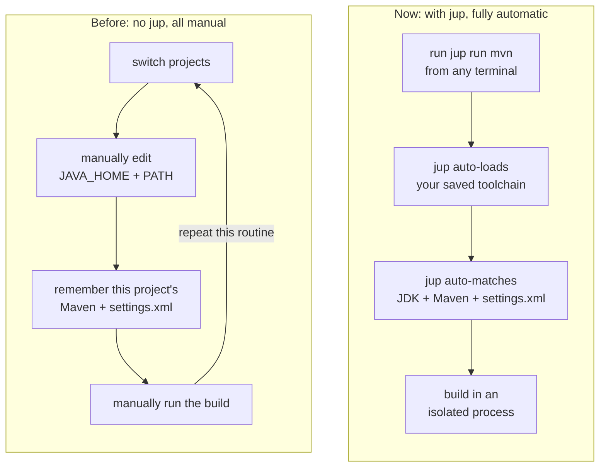

import { Card, CardGrid } from '@astrojs/starlight/components';

## Stop reconfiguring your Java environment

A single dev machine often runs Maven builds that target several different Java
versions, such as Java 8, Java 17, and Java 21. Without `jup`, every project
switch means manually editing `JAVA_HOME` and `PATH`, keeping track of which
Java version and which Maven each repository needs, and occasionally dealing
with projects that rely on different `settings.xml` files. It all gets tedious.

`javaup` (command: `jup`) takes care of this for you. It automatically detects
the Java version a Maven project needs, picks a matching local JDK, and
remembers the Maven executable, JDK, and optional `settings.xml` path that
project uses. It then runs the build in a fresh child process, leaving your
machine's environment variables and your current shell completely untouched —
safe, convenient, and fast.



<CardGrid>
  <Card title="Project-aware" icon="seti:java">
    Bind each repository to the Maven executable, JDK, and settings it actually
    needs, instead of relying on a vague global environment.
  </Card>
  <Card title="Build from anywhere" icon="rocket">
    Select an initialized project and run its build without switching
    directories or reassembling the environment by hand.
  </Card>
  <Card title="Fits your toolchain" icon="puzzle">
    Prefer Maven Wrapper and discover JDKs installed by tools such as SDKMAN!
    and asdf, or exposed through environment variables and PATH.
  </Card>
  <Card title="Cross-platform" icon="laptop">
    Works on Windows, macOS, and Linux, on both amd64 and arm64.
  </Card>
</CardGrid>

## Just type

```shell
cd /path/to/your/maven-project
jup init
jup status
jup run mvn clean package
```

## Start here

- [Install javaup](./start-here/installation/) on Windows, macOS, or Linux.
- Follow the [Quick Start](./start-here/quick-start/) for your first build.
- Keep the [Command Reference](./reference/command-reference/) nearby.
