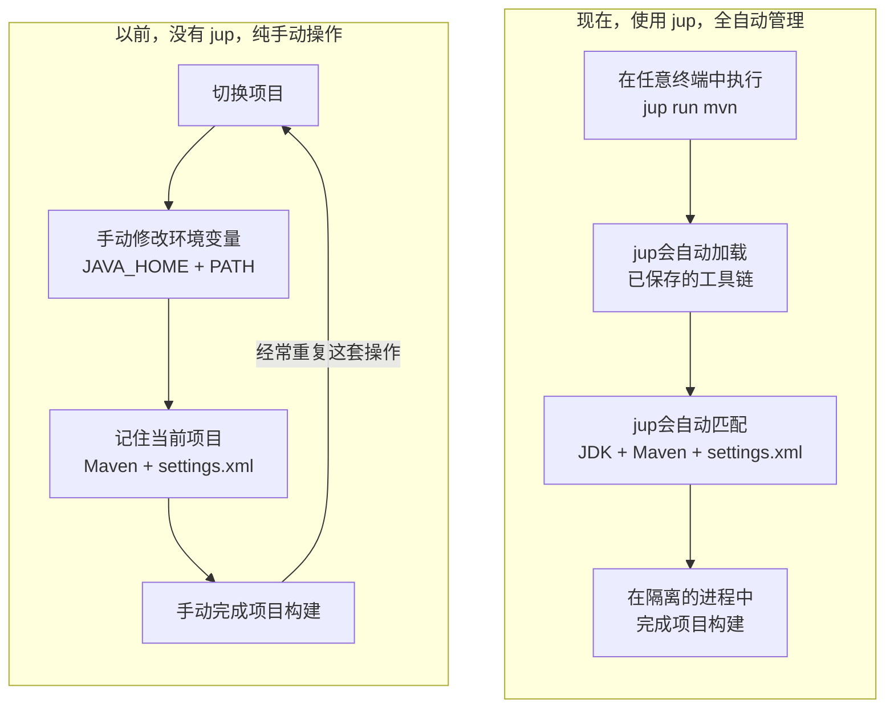

import { Card, CardGrid } from '@astrojs/starlight/components';

## 不再反复配置 Java 环境

一台开发机上往往同时存在多个 Java 版本的 Maven 构建，例如 Java 8、Java 17 和 Java 21。不使用 `jup` 时，每次切换项目都要手工修改 `JAVA_HOME` 和 `PATH`，记住每个仓库应该使用哪个 Java 版本、哪个 Maven 版本，有时还会遇见不同的项目需要依赖不同的 `settings.xml` 文件配置，非常繁琐。

`javaup`（命令名 `jup`）会帮你解决这个问题。它能够自动识别 Maven 项目需要的 Java 版本，选择匹配的本地 JDK，并记住项目使用的 Maven、JDK 和可选的 `settings.xml` 文件路径。然后会在新建的子进程中完成项目构建，完全不动你本机的环境变量和当前 shell 的任何配置，安全、方便、快捷。



<CardGrid>
  <Card title="理解项目" icon="seti:java">
    为每个仓库绑定它真正需要的 Maven、JDK 和 settings，不再依赖模糊的全局环境。
  </Card>
  <Card title="随处构建" icon="rocket">
    选择已初始化的项目即可运行构建，不必切换目录或重新拼装环境。
  </Card>
  <Card title="融入现有工具链" icon="puzzle">
    优先使用 Maven Wrapper，并发现由 SDKMAN!、asdf 等工具安装，或已通过
    环境变量和 PATH 暴露的 JDK。
  </Card>
  <Card title="跨平台" icon="laptop">
    Windows、macOS 和 Linux 均可使用，同时支持 amd64 与 arm64。
  </Card>
</CardGrid>

## 只需输入以下命令

```shell
cd /path/to/your/maven-project
jup init
jup status
jup run mvn clean package
```

## 从这里开始

- 在 Windows、macOS 或 Linux 上[安装 javaup](./start-here/installation/)。
- 跟随[快速开始](./start-here/quick-start/)完成第一次构建。
- 需要查参数时打开[命令参考](./reference/command-reference/)。
